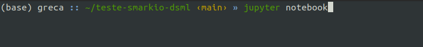

# Teste prático Ciência de Dados (Smarkio)

Teste prático realizado para a vaga de Cientista de Dados Júnior da Smarkio.

## Ferramentas e Bibiliotecas que foram utilizadas
- Python 3
- Jupyter Notebook
- Numpy
- Scikit Learn
- Seaborn
- Matplotlib
- Pandas

## Instalando os pré requisitos

Primeiro precisamos instalar o Python 3 e o pip. Se já tiver baixado no seu computador, pule para o próximo passo.

Execute os seguintes comandos:
```console
sudo apt-get update
sudo apt-get install python3
sudo apt-get install python3-pip
```

Agora iremos instalar o Jupyter Notebook. Para isso execute o comando abaixo:
```console
pip3 install jupyter-lab
pip3 install notebook
```

Se você tiver instalado o pip e não o pip3, basta substituir "pip3" nos comandos anteriores por "pip".

## Como rodar o código

Baixe os arquivos do repositório utilizando o Git, usando o comando: 
```git
git clone https://github.com/rafaelgreca/teste-smarkio-dsml.git
```

Ou clique no botão verde "Code" e baixe o arquivo ZIP. Depois disso descompacte-o.

Depois de baixar o repositório, vá até o local onde ele está instalado e rode o seguinte comando no terminal:
```console
jupyter notebook
```

Como mostra a imagem abaixo.



Após isso uma página irá se abrir no navegador, igual a que está na imagem abaixo.


Clique no arquivo **main.ipynb** e abrirá uma página igual a da imagem abaixo.


Existem duas maneiras de rodar o código:
- Rodar todos os códigos de uma vez: Clique em "Kernel" > "Restart & Clear Output" > "Cell" > "Run All"
- Rodar um por um: Clique em "Kernel" > "Restart & Clear Output" > Selecione a célula que deseja executar > Clicar em "Run". Observação: As células deverão ser executadas na ordem que estão apresentadas.

**IMPORTANTE**: caso você não possua as bibliotecas necessárias instaladas no seu computador, clique na primeira célula de código (onde fala que irá instalar as bibliotecas necessárias) e espera executar. Depois que terminar, clique em "Kernel" > "Restart & Clear Output". Depois disso você estará pronto para rodar o código!